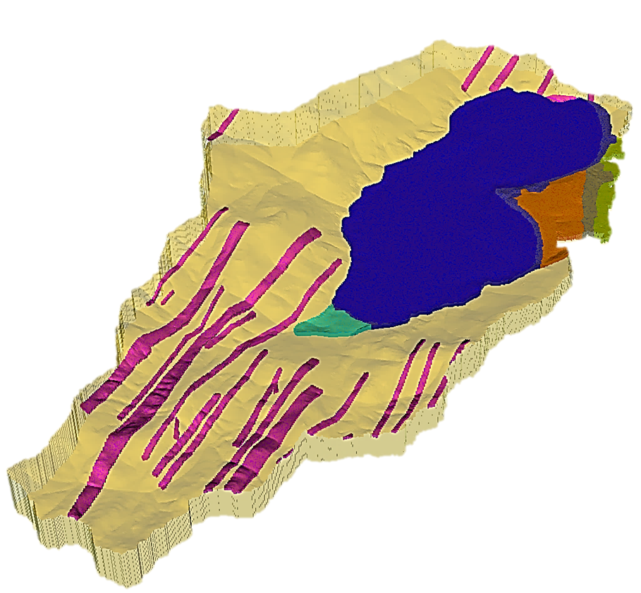

.. PFGIS-Tool documentation master file, created by
   sphinx-quickstart on Monday, June 26, 2023.
   You can adapt this file completely to your liking, but it should at least
   contain the root `toctree` directive.

Welcome to PFGIS-Tool User's Manual!
===================================

**Tomas Carlotto** [1]_, **Julian Klaus** [2]_, **Pedro Luiz Borges Chaffe** [3]_

**PFGIS-Tool** ...

.. note::
   This project is under active development.

.. toctree::
   :maxdepth: 2
   :caption: Contents:
   :numbered:

   intro
   start
   rparflow
   solids
   subsurfacedepth
   writepfb
   
.. [1]
   *Graduate Program in Environmental Engineering, Federal University of Santa Catarina, Florianópolis, Santa Catarina, Brazil.* thomas.carl@hotmail.com

.. [2]
   *Department of Geography, University of Bonn, Bonn, North Rhine-Westphalia, Germany.* jklaus@uni-bonn.de

.. [3]
   *Department of Sanitary and Environmental Engineering, Federal University of Santa Catarina, Florianópolis, Santa Catarina, Brazil* pedro.chaffe@ufsc.br
