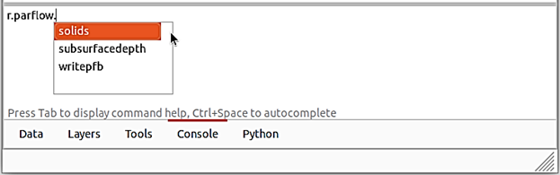

Getting Started
===============

GRASS GIS and PFGIS-Tool installation guide
----------------------------

Install further compilation dependencies:

.. code-block:: console

   sudo apt-get install \
   build-essential \
   flex make bison gcc libgcc1 g++ ccache \
   python3 python3-dev \
   python3-opengl python3-wxgtk4.0 \
   python3-dateutil libgsl-dev python3-numpy \
   wx3.0-headers wx-common libwxgtk3.0-gtk3-dev \
   libwxbase3.0-dev   \
   libncurses5-dev \
   libbz2-dev \
   zlib1g-dev gettext \
   libtiff5-dev libpnglite-dev \
   libcairo2 libcairo2-dev \
   sqlite3 libsqlite3-dev \
   libpq-dev \
   libreadline6-dev libfreetype6-dev \
   libfftw3-3 libfftw3-dev \
   libboost-thread-dev libboost-program-options-dev  libpdal-dev\
   subversion libzstd-dev \
   checkinstall \
   libglu1-mesa-dev libxmu-dev \
   ghostscript wget -y

For NVIZ on Ubuntu

.. code-block:: console
   
   sudo apt-get install \
   ffmpeg libavutil-dev ffmpeg2theora \
   libffmpegthumbnailer-dev \
   libavcodec-dev \
   libxmu-dev \
   libavformat-dev libswscale-dev

Install git

.. code-block:: console

   sudo apt install git
   
Download of the current version of the GRASS GIS from GitHub

.. code-block:: console

   git clone https://github.com/OSGeo/grass.git grass-8.2.0.latest.git
   cd grass-8.2.0.latest.git/
   git checkout releasebranch_8_2
   
Install PFGIS-Tool

.. code-block:: console

   cd raster/
   git clone https://github.com/LabHidro/PFGIS-Tool.git
   mv PFGIS-Tool r.parflow

It is necessary to edit the Makefile file of the raster folder

1 - Open the Makefile file in the text editor

2 - Add r.parflow to the list of subdirectories (SUBDIRS). The script part will look like this:

.. code-block:: console

    SUBDIRS = \
		r.parflow \
		r.basins.fill \
		r.buffer \

3 - Save the changes and close the file.

Return to installation directory

.. code-block:: console
   
   cd ..
   
Compilation
Now we can compile the source code in order to generate the GRASS GIS binaries.
"configure" source code for local machine (checks for CPU type etc):

.. code-block:: console
   
   MYCFLAGS='-O2 -fPIC -fno-common -fexceptions -std=gnu99 -fstack-protector -m64'
   MYLDFLAGS='-Wl,--no-undefined -Wl,-z,now'
   LDFLAGS="$MYLDFLAGS" CFLAGS="$MYCFLAGS" CXXFLAGS="$MYCXXFLAGS" ./configure \
      --with-cxx \
	  --enable-largefile \
	  --with-proj --with-proj-share=/usr/share/proj \
	  --with-gdal=/usr/bin/gdal-config \
	  --with-python \
	  --with-geos \
	  --with-sqlite \
	  --with-nls \
	  --with-zstd \
	  --with-pdal \
	  --with-cairo --with-cairo-ldflags=-lfontconfig \
	  --with-freetype=yes --with-freetype-includes="/usr/include/freetype2/" \
	  --with-wxwidgets \
	  --with-fftw \
	  --with-motif \
	  --with-opengl-libs=/usr/include/GL \
	  --with-postgres=yes --with-postgres-includes="/usr/include/postgresql" \
	  --without-netcdf \
	  --without-mysql \
	  --without-odbc \
	  --without-openmp \
	  --without-ffmpeg

The more CPUs you have, the higher the -j number may be set to
here: build using 4 CPU cores

.. code-block:: console

   make -j4
   
Install

.. code-block:: console

   sudo make install
   
To open GRASS-GIS via the terminal, use the following command

.. code-block:: console

   grass
   
In case of errors in future compilation attempts, remember to remove program binaries with:

.. code-block:: console

   make clean
   
And the files created with the "configuration" from previous compilations with:

.. code-block:: console

   make distclean

Starting a project in GRASS GIS
-------------------------------

To open GRASS-GIS via the terminal, use the following command:

.. code-block:: console

   grass

Under development ...

Starting PFGIS-Tool modules
---------------------------

.. code-block:: console

   r.parflow
    
.. code-block:: console

   r.parflow.solids
   
.. code-block:: console

   r.parflow.subsurfacedepth
   
.. code-block:: console

   r.parflow.writepfb

